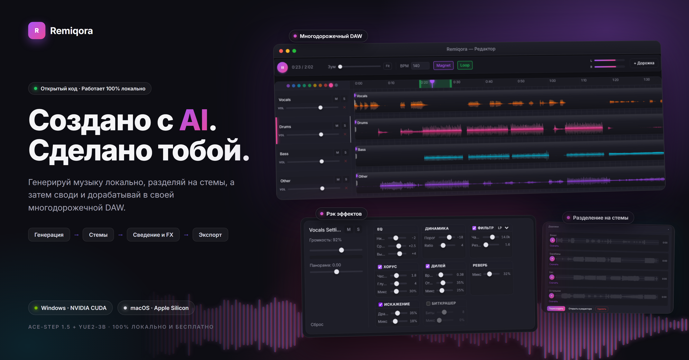
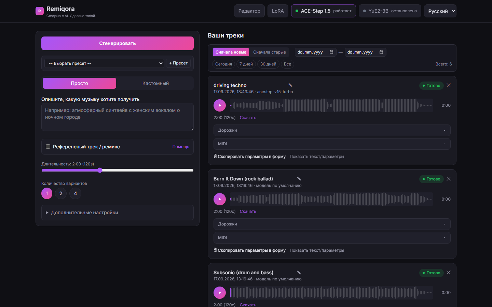
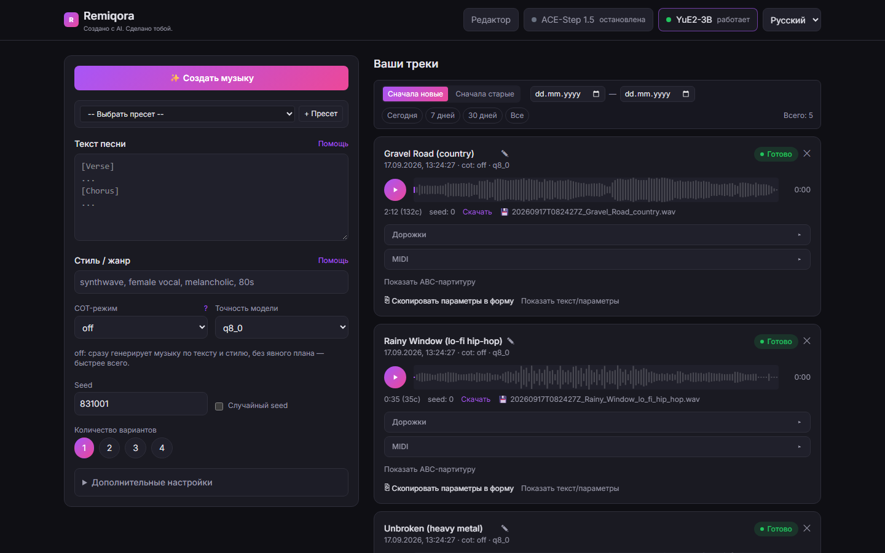
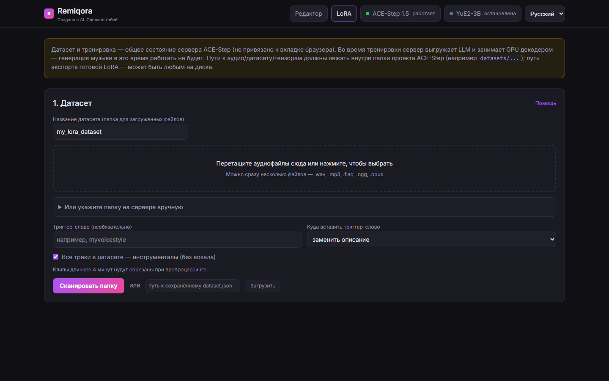
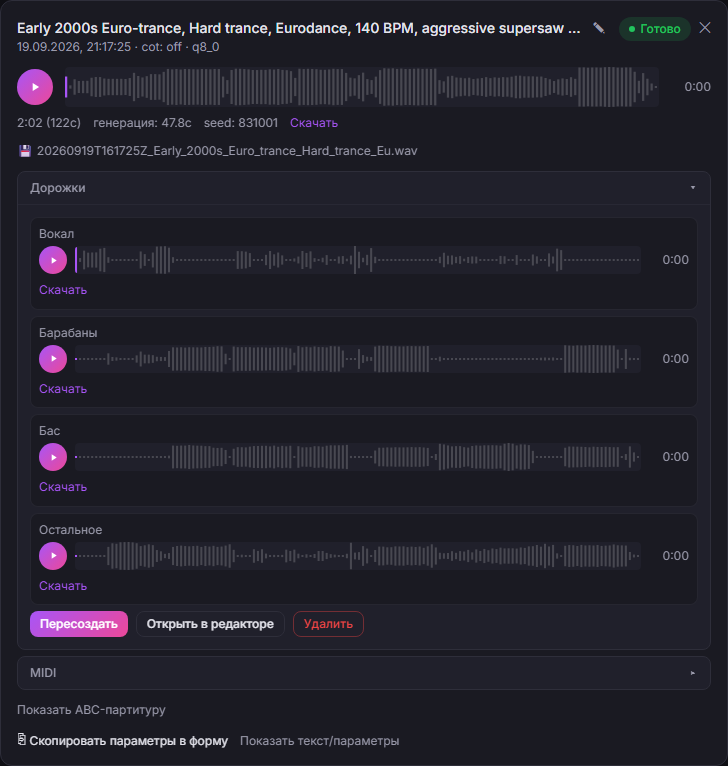
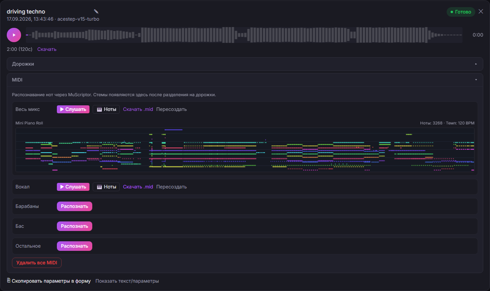
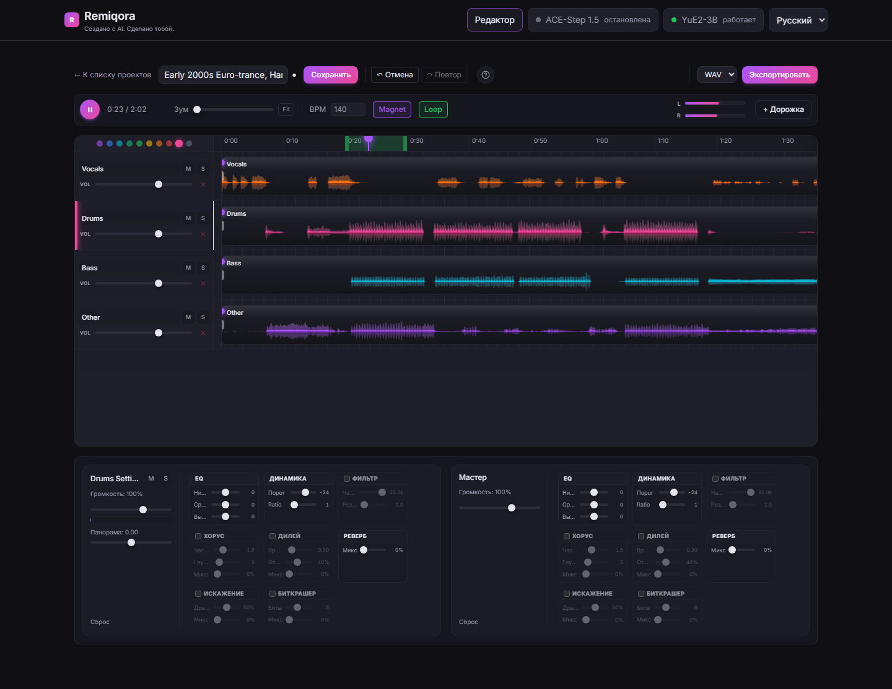
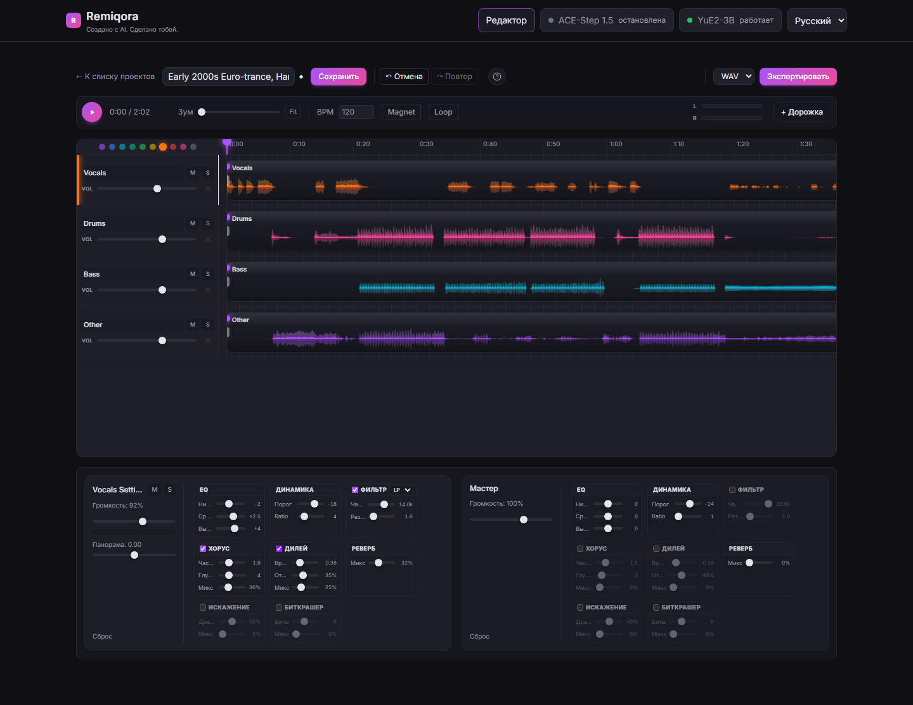
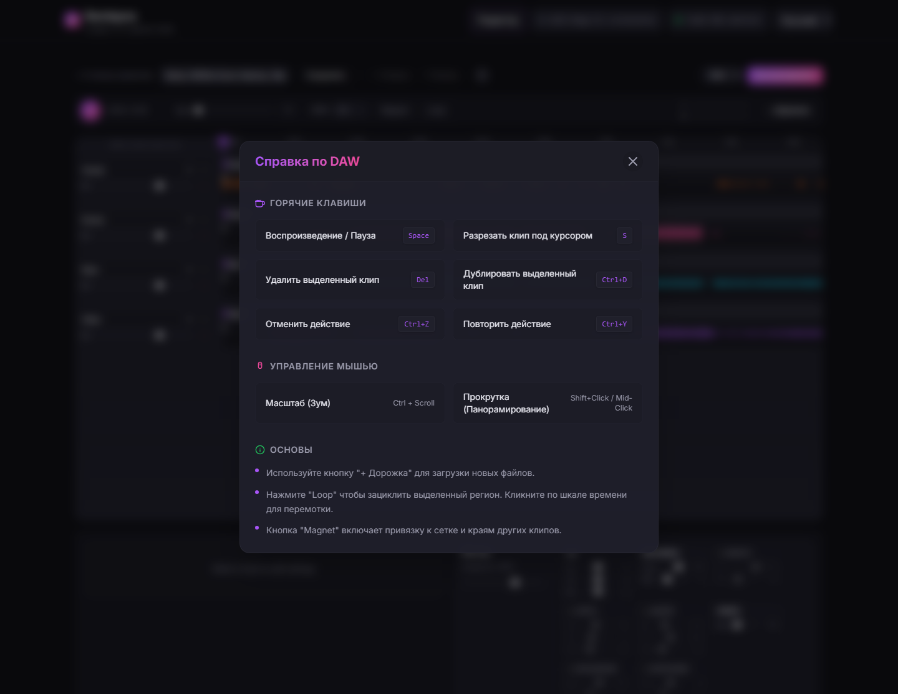

<p align="right"><a href="README.md">English</a> · <b>Русский</b></p>

<p align="center">
  
</p>

<h1 align="center">Remiqora</h1>
<p align="center"><i>Создано с AI. Сделано тобой.</i></p>

<p align="center">
  Локальная студия генерации и продакшна музыки на нейросетях — один интерфейс для <b>ACE-Step 1.5</b> и <b>YuE2-3B</b> со встроенной многодорожечной DAW.
</p>

<p align="center">🚧 В активной разработке — возможны breaking changes, баги и шероховатости. Ещё не стабильный релиз.</p>

<p align="center">
  
  <a href="LICENSE.ru.md"></a>
  
  
  
  
  <a href="https://ko-fi.com/inikolax"></a>
</p>

<p align="center">
  
</p>

<p align="center">
  <a href="#зачем-это-нужно">Зачем</a> ·
  <a href="#что-внутри">Что внутри</a> ·
  <a href="#ace-step-генерация">ACE-Step</a> ·
  <a href="#yue2-и-sheetsage2-генерация">YuE2</a> ·
  <a href="#тренировка-lora-ace-step">LoRA</a> ·
  <a href="#встроенный-daw">DAW</a> ·
  <a href="#основано-на">Основано на</a> ·
  <a href="#лицензия-и-ответственность-за-сгенерированный-контент">Лицензия</a> ·
  <a href="#-установка">Установка</a>
</p>

---

## Зачем это нужно

ACE-Step и YuE2 — два независимых движка генерации музыки, у каждого своя веб-морда, свой формат хранения результатов и свой процесс, который надо руками поднимать и гасить. На одной GPU одновременно они не помещаются. Remiqora решает это одним слоем:

- **Один UI** вместо двух разных интерфейсов с разным UX.
- **Взаимоисключающий оркестратор**: выбрали модель в шапке — она поднимается, а другая гасится сама. Не нужно руками стопать процессы перед стартом другого движка.
- **Общее хранилище**: все треки (сгенерированные, загруженные, собранные в редакторе) сохраняются в единой библиотеке (SQLite + файлы) и доступны из любого модуля — Demucs, MuScriptor и редактор работают с одной и той же библиотекой, а не тремя разными.
- **DAW поверх генерации**: результат генерации — это не конечная точка, а сырьё для дальнейшей сборки: разделить на стемы, перетащить на таймлайн, обработать эффектами, свести с другими треками и экспортировать.
- **Своя LoRA-тренировка**: не только генерация — можно дообучить ACE-Step на собственном голосе/стиле прямо из браузера, без консоли.

---

## Что внутри

| Модуль | Что делает |
|---|---|
| **ACE-Step 1.5** | Быстрая генерация музыки по тексту/тегам стиля, каверы, перерисовка фрагментов, извлечение/добавление партий поверх референсного трека. |
| **YuE2-3B** | Генерация полноформатных треков с CoT-планированием партитуры (символьный ABC-план перед аудио). |
| **SheetSage2** | Извлечение мелодии и гармонии из референсного аудио в ABC-нотацию — как основа для YuE2. |
| **Тренировка LoRA** | Датасет → авто-разметка → препроцессинг → тренировка → экспорт — весь пайплайн дообучения ACE-Step на своём голосе/стиле в браузере. |
| **Demucs** | Разделение любого трека на 4 стема: вокал, барабаны, бас, остальное. |
| **MuScriptor** | Транскрипция аудио (полного микса или отдельного стема) в MIDI-ноты. |
| **Встроенный DAW** | Многодорожечный таймлайн-редактор для сборки треков/стемов в финальный микс: рэк эффектов на каждом канале, авто-BPM и time-stretch, экспорт в WAV/MP3. |

Интерфейс полностью двуязычный (русский/английский, переключатель в шапке).

---

## ACE-Step: генерация



Два режима ввода: **«Просто»** — одно текстовое описание, из которого модель сама выводит стиль и текст песни; и **«Кастомный»** — отдельно теги стиля (с автодополнением) и текст с разметкой структуры (`[Verse]/[Chorus]/[Bridge]`) и исполнительскими аннотациями (`(whisper)`, `(falsetto)`), либо чекбокс «Инструментал».

Если приложить референсный трек, открываются 5 сценариев ремикса:
- **Кавер** — рестайлинг с сохранением мелодии (регулируется силой сохранения оригинала).
- **Перерисовать участок** — заменить только выбранный отрезок трека.
- **Извлечь партию** — вытащить один инструмент/голос из готового микса (12 вариантов: вокал, барабаны, бас, гитара и т.д.).
- **Добавить партию** — досочинить один недостающий инструмент поверх микса.
- **Дописать композицию** — то же самое, но сразу для списка партий.

Плюс: длительность 10–300 сек, батч 1/2/4 варианта, форматы mp3/wav/flac, расширенные параметры (BPM, тональность, размер такта, язык вокала, шаги инференса, guidance scale, seed), поддержка LoRA-адаптеров с регулировкой силы, локальные пресеты параметров и кнопка «Остановить всё» для массовой отмены задач.

## YuE2 и SheetSage2: генерация



Три режима **CoT (Chain-of-Thought)**: `off` — сразу в аудио; `melody` — аранжировка строится вокруг заданной мелодии (ABC); `full` — модель сначала строит символьный план (мелодия+аккорды), потом генерирует аудио.

**SheetSage2** позволяет загрузить референсный трек и одной кнопкой получить его мелодию в ABC-нотации прямо в форме — можно редактировать вручную. Дальше: точность `q8_0`/`q4_0`, батч 1–4, полный набор sampling-параметров отдельно для аудио-генерации и для ABC-планировщика, локальные пресеты, и просмотр/повторное использование ABC-партитуры уже сгенерированного трека.

## Тренировка LoRA (ACE-Step)



Полный пайплайн дообучения ACE-Step на своём датасете, без консоли:

1. **Датасет** — загрузка аудиофайлов прямо через браузер (drag & drop) или указание готовой папки на сервере, триггер-слово, пометка «все треки инструментальные».
2. **Автоматическая разметка** — LLM-описание, жанр, BPM/тональность, распознавание/переформатирование текста песни.
3. **Проверка и правка** — таблица всех сэмплов с возможностью поправить описание/жанр/теги перед тренировкой.
4. **Препроцессинг** — конвертация размеченных сэмплов в тензоры.
5. **Тренировка** — LoRA rank/alpha/dropout, learning rate, эпохи, batch size, FP8, gradient checkpointing, живой прогресс с ETA и ссылкой на TensorBoard.
6. **Экспорт и реестр** — готовый адаптер сразу попадает в список LoRA на форме генерации.

## Разделение на стемы (Demucs)



Одной кнопкой любой сохранённый трек режется на 4 изолированных стема (Demucs `htdemucs`), с прогресс-баром, отдельным плеером и скачиванием на каждый стем, возможностью пересоздать или удалить. Работает параллельно с активной моделью генерации (не останавливая её) на общем GPU-локе. Кнопка **«Открыть в редакторе»** позволяет мгновенно отправить все 4 стема в новый проект встроенного DAW для последующего сведения.

## Транскрипция в MIDI (MuScriptor)



Транскрибирует в MIDI полный микс или любой уже отделённый стем по отдельности. Технически это не отдельный процесс, а модель, подгружаемая в уже запущенный сервер YuE2 — поэтому **транскрипция требует, чтобы активной моделью была именно YuE2**. Результат: встроенный плеер на Web Audio синтезаторе, мини Piano Roll, счётчик нот и BPM, скачивание `.mid`.

## Встроенный DAW



Произвольное число дорожек, на которые можно добавлять что угодно из общей библиотеки (полный микс, отдельный стем, загруженный с диска файл) — через диалог выбора или прямым перетаскиванием файла на дорожку. Быстрее всего начать со стемов: кнопка **«Открыть в редакторе»** на панели стемов создаёт готовый проект из четырёх дорожек (вокал, барабаны, бас, остальное).

### Таймлайн и клипы

- Свободное перемещение и обрезка краёв клипов (не разрушающая — исходный файл не трогается). Клипы всегда прилипают к краям соседних клипов и к нулю таймлайна; кнопка **Magnet** дополнительно включает привязку к сетке по BPM проекта (шаг зависит от масштаба: 1/16, 1/8, 1/4 ноты или такт).
- **Разрез клипа** под курсором (`S`), дублирование (`Ctrl+D`), удаление (`Delete`).
- Кнопки на самом клипе: **M** (mute), **S** (solo), **W** (warp) и ✕. По краям клипа — перетаскиваемые ручки **fade-in / fade-out**; по умолчанию на краях стоят автоматические 15 мс микрофейды, убирающие цифровые щелчки на резких обрезках.
- **Loop**: регион зацикливания на линейке времени — его можно двигать целиком и тянуть за оба края; клик по линейке перематывает воспроизведение.
- **BPM и Warp**: при добавлении клипа из библиотеки или перетаскиванием с диска темп определяется автоматически (по первым 30 секундам). Поле **BPM** задаёт темп проекта, а кнопка **W** подгоняет клип под этот темп time-stretch'ем (SoundTouch), сохраняя тональность. Детектор простой — на сложном материале может ошибаться.
- **Undo/Redo** (`Ctrl+Z` / `Ctrl+Y`) — история до **30 шагов**. Зум — `Ctrl+колесо` или ползунок с кнопкой **Fit**, прокрутка таймлайна — `Shift+перетаскивание` или средняя кнопка мыши.

### Каналы и эффекты



- У каждой дорожки — громкость, панорама, mute/solo и цвет (кружки над списком дорожек), плюс общая мастер-шина.
- **Рэк из 8 эффектов** на каждом канале и на мастере: Эквалайзер (Low/Mid/High, ±12 дБ), Динамика (компрессор: порог и ratio), Фильтр (LP/HP: частота и резонанс), Хорус, Дилей, Реверб, Искажение и Биткрашер. Все эффекты работают в реальном времени, значения параметров показываются рядом со слайдерами.
- Стерео VU-метры мастера (L/R) в тулбаре и индикатор уровня с признаком клиппинга в канале выбранной дорожки.

### Справка



Кнопка **«?»** в тулбаре открывает встроенную справку: список горячих клавиш, управление мышью и короткие подсказки по Loop и Magnet.

### Проект и экспорт

- Проекты хранятся на сервере и открываются из списка. Автосохранения нет — есть кнопка **«Сохранить»**, а при закрытии вкладки или переходе на другую страницу с несохранёнными правками редактор предупреждает о возможной потере.
- Экспорт сведённого проекта в **WAV** или **MP3** — рендерится оффлайн (тот же граф обработки, что и при живом воспроизведении) и сохраняется обратно в общую библиотеку треков.

---

## Архитектура

- **`backend/`** — FastAPI (Python). `app/orchestrator/` управляет жизненным циклом процессов моделей (старт/стоп/health-poll) и обеспечивает их взаимное исключение на одной GPU. `app/api/routes_proxy.py` реверс-проксирует `/api/ace/*` → REST API ACE-Step (порт 8001) и `/api/yue2/*` → нативный сервер YuE2 (`audiocpp_server.exe`, порт 8080). `app/db.py` + `routes_tracks.py` — общая SQLite-база и файлы, разложенные по модели, независимо от того, как трек был создан (генерация, загрузка, сборка в редакторе).
- **`frontend/`** — Vue 3 + TypeScript + Tailwind v4 + Pinia + vue-router + vue-i18n. Полностью нативная реализация (не iframe) поверх оригинальных API моделей — `src/audio/` содержит собственный движок Web Audio (микшер, таймлайн, эффекты, MIDI-парсер и синтезатор, кодировщики WAV/MP3).
- Из кода самих моделей запускается только их процесс инференса (`acestep-api` и `audiocpp_server.exe`) — все остальное (UI, прокси, хранилище, загрузка/транскодирование файлов) написано в этом репозитории. Собственный веб-UI YuE2 (`web-ui/server.py`) больше не используется — единственная полезная часть (транскодирование не-WAV загрузок через ffmpeg) перенесена в `backend/app/api/routes_yue2_upload.py`.

---

## Основано на

Remiqora — это UI и оркестратор поверх сторонних движков инференса. Их код в этот репозиторий не вкладывается, только небольшие функциональные патчи (`external/patches/`) поверх оригиналов:

| Проект | Что используется | Лицензия |
|---|---|---|
| [ACE-Step-1.5](https://github.com/ace-step/ACE-Step-1.5) | Движок генерации музыки по тексту/стилю, LoRA-тренировка | MIT |
| [audio.cpp](https://github.com/0xShug0/audio.cpp) (ветка `dev`) | YuE2 (генерация), SheetSage2 (извлечение мелодии), MuScriptor (транскрипция в MIDI) | Apache-2.0 |
| [Demucs](https://github.com/adefossez/demucs) | Разделение треков на стемы (`htdemucs`) | MIT |

Подробности патчей и точные базовые коммиты — в [`external/patches/README.md`](external/patches/README.md).

---

## Лицензия и ответственность за сгенерированный контент

Собственный код Remiqora (этот репозиторий) распространяется по [лицензии MIT](LICENSE.ru.md) ([английский оригинал](LICENSE) — юридически обязательная версия). Это касается только UI и оркестратора — лицензия самого *трека*, который вы сгенерировали, отдельный вопрос. Remiqora — это оркестратор, а не генератор со своей моделью: всё аудио создают сторонние движки (ACE-Step 1.5, YuE2-3B и построенные поверх них SheetSage2/MuScriptor). Из этого следует:

- **Автор Remiqora не несёт ответственности** за дальнейшую судьбу, использование или распространение треков, сгенерированных через это приложение — ни коммерческую, ни любую другую, опубликованных или приватных. Всё, что вы создаёте, и то, как вы это используете дальше, — полностью на вашей ответственности.
- **На сгенерированный трек действует лицензия той модели, которая его создала**, а не лицензия этого репозитория. Таблица выше — это лицензия *кода*, а лицензия *весов модели* может от неё отличаться:
  - **ACE-Step 1.5** — и код, и веса модели распространяются по лицензии MIT, и авторы модели прямо заявляют, что сгенерированную музыку можно использовать коммерчески.
  - **YuE2-3B** — веса модели (в отличие от *кода* audio.cpp, который под Apache-2.0) распространяются по лицензии **CC BY-NC 4.0**. Это значит, что треки, сгенерированные через YuE2, **нельзя использовать в коммерческих целях** без отдельного разрешения правообладателя, а при любом использовании требуется указание авторства.
- Перед публикацией, монетизацией или иным распространением сгенерированного трека **проверьте актуальные условия лицензии конкретной модели** на её странице/странице весов на HuggingFace — эти условия принадлежат правообладателю модели и могут меняться независимо от этого репозитория.
- Remiqora предоставляется «как есть», без каких-либо гарантий. Используя приложение, вы соглашаетесь, что проверка соответствия сгенерированного трека законодательству и лицензии породившей его модели — исключительно ваша ответственность.
- **Указание авторства**: если вы форкаете, копируете или используете код Remiqora в своих проектах — сохраняйте ссылку на этот репозиторий и на Николая Черкашина ([inikolax](https://github.com/inikolax)) как автора. Лицензия MIT выше уже требует сохранять копирайт-нотис в любой копии — это просто явное напоминание об этом требовании.

---

## 📦 Установка

### Шаг 0: инструменты сборки

```cmd
setup_prereqs.bat
```

Через `winget` (встроен в Windows 10/11) ставит Git, Python, `uv`, Node.js,
CMake, ffmpeg, а также Visual Studio Build Tools (C++ workload) и CUDA
Toolkit — это уже большие, требуют прав администратора и могут занять время.
`setup_prereqs.bat -SkipHeavy` ставит только маленькие быстрые тулы, а
Build Tools/CUDA — вручную по ссылкам, которые скрипт выведет.

**Драйвер NVIDIA GPU намеренно исключён из автоматической установки** — поставьте вручную с
[nvidia.com/drivers](https://www.nvidia.com/drivers) под свою карту: молча
подменять видеодрайвер на чужой машине рискованно (может уронить экран,
часто требует перезагрузки в удобный вам момент, а не скрипту).

После установки закройте терминал и откройте новый, чтобы PATH подхватил
свежепоставленные инструменты.

**На macOS (Apple Silicon):**
```sh
./setup_prereqs.sh
```
Через [Homebrew](https://brew.sh) ставит Git, Python, `uv`, Node.js, CMake,
ffmpeg и Ninja. Отдельного шага с GPU-драйвером нет: Metal встроен в macOS.
CMake/Ninja нужны только для пути `--from-source` ниже — установка YuE2 по
умолчанию вообще не требует компилятора.

### Шаг 1: движки генерации

```cmd
setup_models.bat
```

Скрипт:
1. Клонирует `ace-step/ACE-Step-1.5` (MIT) и `0xShug0/audio.cpp` (Apache-2.0,
   ветка `dev` — поддержка YuE2 пока только там) в `external/`.
2. Накатывает небольшой патч на ACE-Step (API отмены задач; audio.cpp патч
   не требуется, см. `external/patches/README.md`) — без кастомных web-ui из
   апстримов, они не нужны.
3. Запускает `uv sync` для ACE-Step и сборку `audiocpp_server` (CUDA-релиз,
   модели `yue2,sheetsage2,muscriptor`) для audio.cpp.
4. Скачивает GGUF-веса YuE2/SheetSage2/MuScriptor (~10 ГБ) через
   `tools/model_manager_v2.py` из audio.cpp.
5. Поднимает uv-проект с `demucs` в `external/Demucs` для разделения на
   стемы, привязанный к индексу колёс PyTorch `cu128`, чтобы встала именно
   CUDA-сборка (простой `uv add demucs` тихо поставил бы CPU-версию torch).
6. Создаёт `backend/.env` с путями на только что склонированные репозитории,
   включая `FFMPEG_BIN_DIR` — путь определяется автоматически из
   winget-установки ffmpeg (`setup_prereqs.bat`), даже если она была
   поставлена в этом же терминале, до того как новый терминал подхватил бы
   её в PATH.

Веса самого ACE-Step отдельно скачивать не нужно — `acestep-api` тянет их
сам с HuggingFace/ModelScope при первом запросе, так же как это делает его
Gradio UI.

Скрипт идемпотентен — его можно перезапускать (флаги `-SkipBuild` /
`-SkipWeights` пропускают соответствующие шаги). Для работы скрипта должны быть предварительно установлены:
`git`, [`uv`](https://docs.astral.sh/uv/getting-started/installation/), Python 3,
CMake, CUDA Toolkit и Visual Studio Build Tools (C++ workload) — при
отсутствии какого-то из них шаг просто пропускается с подсказкой, что
поставить.

После этого вручную остаётся только проверить `CUDA_BIN_DIR` в
`backend/.env` (`FFMPEG_BIN_DIR` подставляется сам — если только ffmpeg
вообще не нашёлся, тогда скрипт об этом явно предупредит, и путь придётся
указать руками).

Жёсткие требования к машине, которые скрипт снять не может: Windows,
NVIDIA GPU с поддержкой CUDA (тестировалось на RTX 4080 16 ГБ) и
установленный видеодрайвер.

**На macOS (Apple Silicon):**
```sh
./setup_models.sh
```
Адаптировано под macOS, с одним отличием от шагов Windows выше: по
умолчанию `audiocpp_server` устанавливается из готового **прекомпилированного
macOS/Metal релиза** audio.cpp (закреплённый тег, sha256 проверяется перед
распаковкой) — компилятор вообще не нужен, в отличие от Windows-пути,
который всегда собирает из исходников, поскольку готового CUDA-релиза не
существует. Uv-проект Demucs тоже не привязывается к CUDA-индексу колёс —
обычная зависимость `torch` и так резолвится в MPS-совместимое колесо на
darwin/arm64, точно так же, как в `pyproject.toml` самого ACE-Step-1.5. В
записанном `backend/.env` нет `CUDA_BIN_DIR` — CUDA Toolkit на этом пути
не нужен.

Флаг `--from-source` вместо скачивания релиза соберёт audio.cpp из того же
закреплённого коммита ветки `dev`, что использует Windows (пригодится, если
релиз отстал от фикса, который есть только в `dev`, либо на Intel Mac, для
которого готового бинарника нет) — для этого пути нужен полный **Xcode.app**
(не только Command Line Tools) из-за Metal-компилятора шейдеров;
`setup_prereqs.sh` выведет точные шаги, если его не хватает. `--skip-build` /
`--skip-weights` — аналоги `-SkipBuild` / `-SkipWeights`. В остальном скрипт
ожидает, что `git`, `uv` и Python 3 уже установлены (а для `--from-source`
ещё и `cmake`).

Жёсткие требования к машине на пути по умолчанию (готовый бинарник): macOS,
Apple Silicon (чип серии M) — для Intel нужен `--from-source`. Проверено на
MacBook Air, Apple M5, 24 ГБ RAM — включая прогон с абсолютно чистого
состояния (без единого brew-пакета и файлов проекта) до генерации
аудио через YuE2 на Metal-бэкенде.
Этот путь новее и меньше обкатан, чем Windows/CUDA — ожидайте, что будет медленнее
(Metal вместо CUDA). Именно `--from-source` может периодически требовать
ручной подстройки (сдвинуть закреплённый коммит), если ветка `dev` audio.cpp
уйдёт вперёд; путь с готовым релизом закреплён на фиксированном теге и сам
по себе не «уезжает».

### Шаг 2: запуск

```cmd
dev.bat
```
Поднимает бэкенд (порт 9000) и фронтенд с Hot Module Replacement (Vite, порт 5173), сам создаёт `backend/.venv` и `frontend/node_modules` при первом запуске, открывает браузер на [http://localhost:5173](http://localhost:5173).

Для боевого режима — сборка SPA и раздача с одного порта:
```cmd
prod_run.bat
```
Собирает клиент через `npm run build` и раздаёт готовый SPA-дистрибутив вместе с API на [http://127.0.0.1:9000](http://127.0.0.1:9000).

Uv-проект `demucs` для разделения на стемы поднимает сам `setup_models.bat` (см. выше); веса `htdemucs` скачиваются отдельно и сами при первом использовании.

**На macOS:** аналоги — `./dev.sh` и `./prod_run.sh`, ведут себя так же, только
бэкенд и фронтенд запускаются как фоновые задачи самого скрипта (остановить
оба — Ctrl+C), а не в отдельных окнах терминала.

---

## ⚙ Конфигурация (.env)

Настройки хранятся в файле `backend/.env` (шаблон — `backend/.env.example`,
`setup_models.bat` создаёт его автоматически с путями на клонированные репозитории):
```ini
ACE_STEP_DIR=E:\AI\ACE\ACE-Step-1.5
YUE2_DIR=E:\AI\YuE2-3B
DEMUCS_DIR=E:\AI\Demucs
FFMPEG_BIN_DIR=E:\AI\ACE\tools\ffmpeg-shared\ffmpeg-master-latest-win64-gpl-shared\bin
CUDA_BIN_DIR=C:\Program Files\NVIDIA GPU Computing Toolkit\CUDA\v13.4\bin
```

- `ACE_STEP_DIR` — корень склонированного и запатченного ACE-Step-1.5.
- `YUE2_DIR` — корень склонированного и запатченного audio.cpp (там же собран `audiocpp_server.exe` и лежат GGUF-веса YuE2/SheetSage2/MuScriptor).
- `DEMUCS_DIR` — корень uv-проекта с `demucs`, используемого для разделения на стемы.
- `FFMPEG_BIN_DIR` — папка с `ffmpeg.exe`/`ffprobe.exe`.
- `CUDA_BIN_DIR` — папка `bin` установленного CUDA Toolkit (нужна в PATH для `audiocpp_server.exe`). Только для Windows — на macOS остаётся пустым, там YuE2 работает через Metal-бэкенд.

---

## Известные ограничения

- ACE-Step и YuE2 не могут работать одновременно — одна GPU на двоих, оркестратор переключает их взаимоисключающе.
- Транскрипция в MIDI требует активной именно YuE2 (модель MuScriptor подгружается в её процесс).
- Поддерживаются Windows (NVIDIA CUDA) и macOS/Apple Silicon (Metal/MPS) — под первую написаны `.bat`/`.ps1`, под вторую `.sh`. Скриптов под Linux пока нет, хотя сам бэкенд уже не содержит Windows-специфичного кода, который бы это блокировал.
- Путь macOS/Metal новее и меньше обкатан, чем Windows/CUDA — ожидайте, что будет медленнее. По умолчанию он ставит YuE2 из готового релиза с закреплённым тегом (компилятор не нужен); `--from-source` собирает тот же коммит `dev`, что и Windows, и может изредка требовать сдвинуть этот пин, если `dev` уйдёт вперёд.
